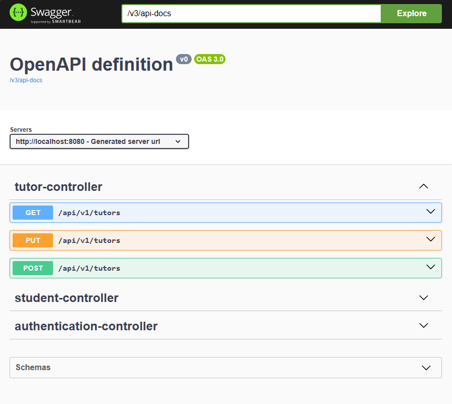

# Full stack app backend

This repository is the backend of a full stack application that allows intern tutors to manage intern students. 
It is a draft, purely designed as part of personal learning. This project aimed to introduce me to Spring modules 
such as Spring Security, Spring Data JPA, Springdoc OpenAPI, and more. Some details aspects have been intentionally omitted
for simplicity reasons.

### Short api description

